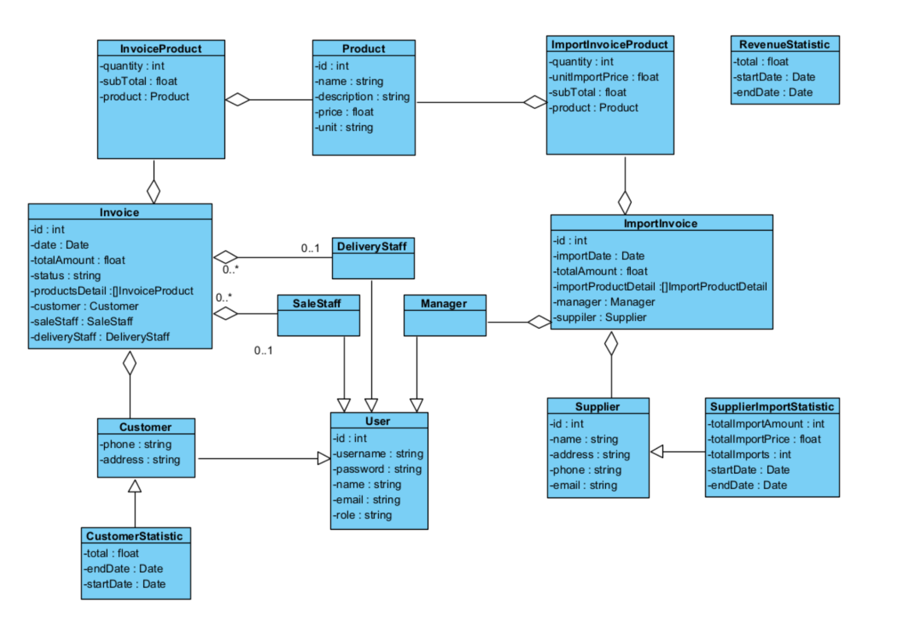

Thực hiện 2 module dựa trên sơ đồ lớp thực thể, sơ đồ erd cơ sở dữ liệu và sơ đồ lớp module

- Actor Customer:
- Module Tra cứu hoá đơn
- Scenario:
  Tại giao diện chính của khách hàng, sau khi đăng nhập, khách hàng click chọn tính năng Tra cứu hóa đơn.
  Trang HomeCustomer.jsp gọi trang SearchInvoice.jsp
  Trang SearchInvoice.jsp gọi lớp InvoiceServlet yêu cầu lấy danh sách hóa đơn của khách hàng
  Lớp InvoiceServlet gọi hàm doGet()
  Hàm doGet() gọi lớp InvoiceDAO
  Lớp InvoiceDAO gọi hàm getListInvoiceOfCustomer()
  Hàm getListInvoiceOfCustomer() thực hiện lặp gọi lớp Invoice để đóng gói thông tin
  Lớp Invoice đóng gói thông tin thành thực thể
  Lớp Invoice trả về kết quả cho lớp InvoiceDAO
  Lớp InvoiceDAO trả về kết quả cho lớp InvoiceServlet
  Lớp InvoiceServlet trả về kết quả cho trang SearchInvoice.jsp
  Trang SearchInvoice.jsp hiện thị giao diện cho khách hàng
  Khách hàng chọn một hóa đơn
  Trang SearchInvoice.jsp gọi trang InvoiceDetail.jsp
  Trang InvoiceDetail.jsp gọi lớp InvoiceServlet
  Lớp InvoiceServlet gọi hàm doGet()
  Hàm doGet() gọi lớp InvoiceDAO
  Lớp InvoiceDAO gọi hàm getInvoiceDetail()
  Hàm getInvoiceDetail() gọi lớp Invoice yêu cầu đóng gói thông tin
  Lớp Invoice gọi hàm Invoice() đóng gói thông tin thành thực thể
  Hàm Invoice() thực hiện lặp gọi lớp InvoiceProduct để đóng gói thông tin
  Lớp InvoiceProduct gọi hàm InvoiceProduct() đóng gói thông tin thành thực thể
  Hàm InvoiceProduct() gọi lớp Product đóng gói thông tin
  Lớp Product đóng gói thông tin thành thực thể
  Lớp Product trả về kết quả cho lớp InvoiceProduct
  Lớp InvoiceProduct trả về kết quả cho lớp Invoice
  Lớp Invoice gọi lớp DeliveryStaff để đóng gói thông tin
  Lớp DeliveryStaff đóng gói thông tin thành thực thể
  Lớp DeliveryStaff trả về kết quả cho lớp Invoice
  Lớp Invoice gọi lớp SaleStaff để đóng gói thông tin
  Lớp SaleStaff đóng gói thông tin thành thực thể
  Lớp SaleStaff trả về kết quả cho lớp Invoice
  Lớp Invoice gọi lớp Customer để đóng gói thông tin
  Lớp Customer đóng gói thông tin thành thực thể
  Lớp Customer trả về kết quả cho lớp Invoice
  Lớp Invoice trả về kết quả InvoiceDAO
  Lớp InvoiceDAO trả về kết quả cho lớp InvoiceServlet
  Lớp InvoiceServlet trả về kết quả cho trang InvoiceDetail.jsp
  Trang InvoiceDetail.jsp hiện thị thông tin cho khách hàng.

Actor: Manager
- Module: Xem thống kê nhà cung cấp theo lượng hàng 
- Scenario:
  Tại giao diện chính của quản lý, sau khi đăng nhập, quản lý click chọn chức năng Xem thống kê nhà cung cấp theo lượng hàng nhập.
  Trang HomeManager.jsp gọi trang SupplierStatistic.jsp
  Trang SupplierStatistic.jsp hiển thị giao diện
  Quản lý chọn Ngày bắt đầu và Ngày kết thúc thống kê và nhấn submit
  Trang SupplierStatistic.jsp gọi lớp SupplierImportStatisticServlet yêu cầu lấy kết quả thống kê.
  Lớp SupplierImportStatisticServlet gọi hàm doGet()
  Hàm doGet() gọi lớp SupplierImportStatisticDAO.
  Lớp SupplierImportStatisticDAO gọi hàm getListSupplierImportStatistic()
  Hàm getListSupplierImportStatistic() thực hiện lặp gọi lớp SupplierImportStatistic để đóng gói thông tin
  Lớp SupplierImportStatistic đóng gói thông tin thực thể
  Lớp SupplierImportStatistic trả về kết quả cho lớp SupplierImportStatisticDAO
  Lớp SupplierImportStatisticDAO trả về kết quả cho lớp SupplierImportStatisticServlet
  Lớp SupplierImportStatisticServlet trả về kết quả cho lớp SupplierStatistic.jsp
  Trang SupplierStatistic.jsp hiển thị kết quả cho quản lý
  Quản lý chọn một nhà cung cấp
  Trang SupplierStatistic.jsp gọi trang ListImportInvoicet.jsp
  Trang ListImportInvoice.jsp gọi lớp ImportInvoiceServlet yêu cầu tìm danh sách hóa đơn nhập
  Lớp ImportInvoiceServlet gọi hàm doGet()
  Hàm doGet() gọi lớp ImportInvoiceDAO
  Lớp ImportInvoiceDAO gọi hàm getListImportInvoice()
  Hàm getListImportInvoice() thực hiện lặp gọi lớp ImportInvoice để đóng gọi thông tin
  Lớp ImportInvoice đóng gói thông tin thực thể
  Lớp ImportInvoice trả về kết quả cho lớp ImportInvoiceDAO
  Lớp ImportInvoiceDAO trả về kết quả cho lớp ImportInvoiceServlet
  Lớp ImportInvoiceServlet trả về kết quả cho trang ListImportInvoice.jsp
  Trang ListImportInvoice.jsp hiển thị cho quản lý
  Quản lý chọn một hóa đơn nhập
  Trang ListImportInvoice.jsp gọi trang ImportInvoiceDetail.jsp
  Trang ImportInvoiceDetail.jsp gọi lớp ImportInvoiceServlet yêu cầu lấy thông tin chi tiết hóa đơn
  Lớp ImportInvoiceServlet gọi hàm doGet()
  Hàm doGet() gọi lớp ImportInvoiceDAO
  Lớp ImportInvoiceDAO gọi hàm getImportInvoiceDetail()
  Hàm getImportInvoiceDetail() gọi lớp ImportInvoice để đóng gói thông tin
  Lớp ImportInvoice gọi hàm ImportInvoice() để đóng gói thông tin thành thực thể
  Hàm ImportInvoice() thực hiện lặp gọi lớp ImportInvoiceProduct để đóng gói thông tin
  Lớp ImportInvoiceProduct gọi hàm ImportInvoiceProduct() thực hiện đóng gói thông tin thành thực thể.
  Hàm ImportInvoiceProduct() gọi lớp Product để đóng gói thông tin
  Lớp Product đóng gói thông tin thành thực thể
  Lớp Product trả về kết quả cho lớp ImportInvoiceProduct
  Lớp ImportInvoiceProduct trả về kết quả cho lớp ImportInvoice
  Lớp ImportInvoice gọi lớp Supplier yêu cầu đóng gói thông tin
  Lớp Supplier đóng gói thông tin thành thực thể
  Lớp Supplier trả về kết quả cho lớp ImportInvoice
  Lớp ImportInvoice gọi lớp Manager yêu cầu đóng gói thông tin
  Lớp Manager đóng gói thông tin thành thực thể
  Lớp Manager trả về kết quả cho lớp ImportInvoice
  Lớp ImportInvoice trả về kết quả cho lớp ImportInvoiceDAO
  Lớp ImportInvoiceDAO trả về kết quả cho lớp ImportInvoiceServlet
  Lớp ImportInvoiceServlet trả về kết quả cho trang ImportInvoiceDetail.jsp
  Trang ImportInvoiceDetail.jsp hiển thị kết quả cho quản lý.

# Modules chi tiết (thực hiện 2 module)

Dưới đây là mô tả chi tiết, hợp đồng (contract), dữ liệu đầu vào/đầu ra, các lớp liên quan và ví dụ SQL cho hai module yêu cầu: "Tra cứu hóa đơn" cho Actor Customer và "Thống kê nhà cung cấp theo lượng hàng" cho Actor Manager.

---

## Module 1 — Tra cứu hoá đơn (Actor: Customer)

Mục tiêu: Cho phép khách hàng xem danh sách hoá đơn của chính họ và xem chi tiết từng hoá đơn (sản phẩm, nhân viên giao hàng, nhân viên bán hàng, thông tin khách hàng, tổng tiền...)

Giao diện / luồng:
- HomeCustomer.jsp -> liên kết đến SearchInvoice.jsp
- SearchInvoice.jsp tải danh sách hoá đơn của khách hàng (sau khi đăng nhập)
- Người dùng click vào một hoá đơn -> chuyển đến InvoiceDetail.jsp (hiển thị chi tiết)

Contract (tóm tắt):
- Endpoint list: `/invoice/list` (InvoiceServlet, handle GET)
  - Input: currentSession.account.id (customerId) hoặc request param `customerId` (long)
  - Output: List<InvoiceSummary> được set trên request attribute `invoices` và forward đến `/customer/SearchInvoice.jsp`
- Endpoint detail: `/invoice/detail` (InvoiceServlet, handle GET)
  - Input: request param `invoiceId` (long)
  - Output: Invoice (chứa list InvoiceProduct, DeliveryStaff, SaleStaff, Customer) được set attribute `invoice` và forward đến `/customer/InvoiceDetail.jsp`

Dữ liệu (entities, minimal fields):
- InvoiceSummary { id, invoiceCode, date, totalAmount, status }
- Invoice {
  id, invoiceCode, date, totalAmount, status,
  Customer customer,
  DeliveryStaff deliveryStaff,
  SaleStaff saleStaff,
  List<InvoiceProduct> products
 }
- InvoiceProduct { id, product: Product, quantity, unitPrice, subtotal }
- Product { id, name, sku, price }
- Customer { id, name, email, phone, address }
- DeliveryStaff, SaleStaff { id, name, phone }

DAO contract (methods):
- class InvoiceDAO {
  List<InvoiceSummary> getListInvoiceOfCustomer(long customerId) throws SQLException;
  Invoice getInvoiceDetail(long invoiceId) throws SQLException;
 }

Ví dụ SQL (giả định tên bảng, điều chỉnh theo schema thực tế trong `database_schema.sql`):
- getListInvoiceOfCustomer:
  SELECT i.id, i.invoice_code, i.date, i.total_amount, i.status
  FROM invoice i
  WHERE i.customer_id = ?
  ORDER BY i.date DESC;

- getInvoiceDetail:
  -- Thông tin hoá đơn chính
  SELECT i.id, i.invoice_code, i.date, i.total_amount, i.status, i.customer_id, i.delivery_staff_id, i.sale_staff_id
  FROM invoice i
  WHERE i.id = ?;

  -- Các mặt hàng hoá đơn
  SELECT ip.id, ip.product_id, ip.quantity, ip.unit_price
  FROM invoice_product ip
  WHERE ip.invoice_id = ?;

  -- Thông tin product
  SELECT p.id, p.name, p.sku, p.price
  FROM product p
  WHERE p.id IN (...list product ids...);

  -- Thông tin customer, delivery_staff, sale_staff (theo id từ invoice)

Mapping trong code (Invoice.java, InvoiceProduct.java, Product.java, Customer.java, DeliveryStaff.java, SaleStaff.java) — mỗi class có constructor hoặc factory method để nhận ResultSet và đóng gói entity.

Servlet / JSP mapping (đề xuất):
- InvoiceServlet (mapping `/invoice/*`)
  - doGet: switch trên `action` param hoặc trên pathInfo
    - action=list -> gọi invoiceDAO.getListInvoiceOfCustomer(customerId) -> setAttribute("invoices", list) -> forward `/customer/SearchInvoice.jsp`
    - action=detail -> gọi invoiceDAO.getInvoiceDetail(invoiceId) -> setAttribute("invoice", invoice) -> forward `/customer/InvoiceDetail.jsp`

Edge cases & validation:
- Không tìm thấy invoice cho customer -> trả về empty list và message "Không có hoá đơn nào"
- InvoiceId không hợp lệ/không tồn tại -> 404 hoặc forward tới trang lỗi với thông báo
- Quyền truy cập: ensure session customerId trùng với owner của invoice khi xem chi tiết (security check)
- SQL exceptions -> log & show user-friendly message

Tests (gợi ý):
- Unit test InvoiceDAO.getListInvoiceOfCustomer với mock DB (happy path, empty result)
- Unit test InvoiceDAO.getInvoiceDetail trả về object đầy đủ (products + staff + customer)
- Integration test Servlet basic flows (mock session)

Tiếp cận cài đặt nhanh (bước nhỏ):
1. Tạo/kiểm tra model classes: Invoice, InvoiceProduct, Product, Customer, DeliveryStaff, SaleStaff (constructor(ResultSet) hoặc static factory fromResultSet)
2. Thêm methods vào `InvoiceDAO.java` theo contract và SQL
3. Cập nhật `InvoiceServlet.java` để dispatch action list/detail
4. Tạo/hoàn thiện `SearchInvoice.jsp` và `InvoiceDetail.jsp` trong thư mục webapp (kiểm tra đường dẫn hiện tại trong project)
5. Viết unit tests

---

## Module 2 — Thống kê nhà cung cấp theo lượng hàng (Actor: Manager)

Mục tiêu: Cho phép quản lý thống kê tổng lượng hàng nhập từ các nhà cung cấp trong khoảng thời gian xác định, chọn nhà cung cấp để xem các hoá đơn nhập chi tiết và xem chi tiết từng hoá đơn nhập.

Giao diện / luồng:
- HomeManager.jsp -> SupplierStatistic.jsp
- SupplierStatistic.jsp: form chọn `startDate` và `endDate` -> submit -> gọi SupplierImportStatisticServlet
- Kết quả: danh sách SupplierImportStatistic (supplierId, supplierName, totalImportedQuantity, totalImportValue)
- Click supplier -> ListImportInvoice.jsp (liệt kê các hoá đơn nhập của supplier trong khoảng thời gian)
- Click một hoá đơn nhập -> ImportInvoiceDetail.jsp (chi tiết hoá đơn nhập)

Contract (tóm tắt):
- Endpoint statistic: `/supplier/statistic` (SupplierImportStatisticServlet)
  - Input: startDate (yyyy-MM-dd), endDate (yyyy-MM-dd)
  - Output: List<SupplierImportStatistic> attribute `stats` -> forward `/manager/SupplierStatistic.jsp`
- Endpoint list import invoices: `/importinvoice/list` (ImportInvoiceServlet?action=list)
  - Input: supplierId, startDate, endDate
  - Output: List<ImportInvoiceSummary> attribute `importInvoices` -> forward `/manager/ListImportInvoice.jsp`
- Endpoint import invoice detail: `/importinvoice/detail` (ImportInvoiceServlet?action=detail)
  - Input: importInvoiceId
  - Output: ImportInvoice (with List<ImportInvoiceProduct>, Supplier, Manager) attribute `importInvoice` -> forward `/manager/ImportInvoiceDetail.jsp`

Dữ liệu (entities, minimal fields):
- SupplierImportStatistic { supplierId, supplierName, totalQuantity, totalValue }
- ImportInvoiceSummary { id, invoiceCode, date, totalQuantity, totalValue }
- ImportInvoice { id, invoiceCode, date, totalValue, Supplier supplier, Manager manager, List<ImportInvoiceProduct> products }
- ImportInvoiceProduct { id, product: Product, quantity, unitPrice, subtotal }
- Product, Supplier, Manager similar structure với các fields cơ bản

DAO contract (methods):
- class SupplierImportStatisticDAO {
  List<SupplierImportStatistic> getListSupplierImportStatistic(Date startDate, Date endDate) throws SQLException;
 }
- class ImportInvoiceDAO {
  List<ImportInvoiceSummary> getListImportInvoice(long supplierId, Date startDate, Date endDate) throws SQLException;
  ImportInvoice getImportInvoiceDetail(long importInvoiceId) throws SQLException;
 }

Ví dụ SQL (giả định tên bảng):
- getListSupplierImportStatistic:
  SELECT s.id as supplier_id, s.name as supplier_name,
         SUM(iip.quantity) AS total_quantity,
         SUM(iip.quantity * iip.unit_price) AS total_value
  FROM import_invoice ii
  JOIN import_invoice_product iip ON ii.id = iip.import_invoice_id
  JOIN supplier s ON ii.supplier_id = s.id
  WHERE ii.date BETWEEN ? AND ?
  GROUP BY s.id, s.name
  ORDER BY total_quantity DESC;

- getListImportInvoice (theo supplier trong khoảng):
  SELECT ii.id, ii.invoice_code, ii.date, SUM(iip.quantity) AS total_qty, SUM(iip.quantity * iip.unit_price) AS total_value
  FROM import_invoice ii
  JOIN import_invoice_product iip ON ii.id = iip.import_invoice_id
  WHERE ii.supplier_id = ? AND ii.date BETWEEN ? AND ?
  GROUP BY ii.id, ii.invoice_code, ii.date
  ORDER BY ii.date DESC;

- getImportInvoiceDetail: tương tự module hoá đơn xuất nhưng với import tables + supplier + manager + products

Mapping/flow trong code:
- SupplierImportStatisticDAO.getListSupplierImportStatistic -> thực hiện query và với mỗi row tạo SupplierImportStatistic instance
- ImportInvoiceDAO.getListImportInvoice -> trả về list ImportInvoiceSummary
- ImportInvoiceDAO.getImportInvoiceDetail -> build ImportInvoice object, load ImportInvoiceProduct, mỗi ImportInvoiceProduct load Product, set Supplier, set Manager

Servlets/JSP (đề xuất):
- SupplierImportStatisticServlet (mapping `/supplier/statistic`)
  - doGet: parse startDate/endDate -> dao.getListSupplierImportStatistic(...) -> setAttribute("stats", list) -> forward `/manager/SupplierStatistic.jsp`
- ImportInvoiceServlet (mapping `/importinvoice/*`)
  - action=list -> dao.getListImportInvoice(supplierId, startDate, endDate) -> forward to `/manager/ListImportInvoice.jsp`
  - action=detail -> dao.getImportInvoiceDetail(importInvoiceId) -> forward to `/manager/ImportInvoiceDetail.jsp`

Edge cases & validation:
- startDate > endDate -> return validation error
- Khoảng thời gian quá dài -> performance consideration (pagination/limit)
- Supplier không có hoá đơn trong khoảng -> trả về empty list
- SQL exceptions -> log & show message

Tests (gợi ý):
- Unit test DAO for aggregation results (group by, sum) with controlled data
- Integration tests for servlet flows

---

## Yêu cầu triển khai ngắn gọn (task breakdown)

1. Kiểm tra `src/main/resources/database_schema.sql` để xác nhận tên bảng/column; nếu khác, điều chỉnh SQL trong DAO.
2. Tạo/hoàn thiện các entity model (Invoice, InvoiceProduct, ImportInvoice, ImportInvoiceProduct, SupplierImportStatistic) nếu chưa có.
3. Implement DAO methods trong `com.shopman.dao` (tạo file `InvoiceDAO.java`, `ImportInvoiceDAO.java`, `SupplierImportStatisticDAO.java` nếu cần).
4. Implement/Update Servlets (`InvoiceServlet`, `ImportInvoiceServlet`, `SupplierImportStatisticServlet`) trong `com.shopman.servlet`.
5. Tạo/Update JSP views: `SearchInvoice.jsp`, `InvoiceDetail.jsp` cho client; `SupplierStatistic.jsp`, `ListImportInvoice.jsp`, `ImportInvoiceDetail.jsp` cho manager. Sử dụng taglib JSTL để lặp danh sách.
6. Thêm server-side validation & session checks (đảm bảo customer chỉ xem hoá đơn của mình).
7. Viết unit tests cho DAO và một vài integration tests cho Servlets nếu có framework (JUnit + mock DB hoặc H2 in-memory).

---

## Edge cases & performance notes
- Với bảng hoá đơn và hoá đơn sản phẩm lớn, cần pagination trên `getList*` queries.
- Aggregation queries (thống kê) cần index trên `import_invoice.date`, `import_invoice.supplier_id` và `import_invoice_product.import_invoice_id`.
- Nếu thời gian truy vấn dài, cân nhắc tạo view/summary table cập nhật định kỳ.

---

## Requirements coverage (mapping yêu cầu -> trạng thái)
- Tra cứu hoá đơn (Customer)
  - Lấy danh sách hoá đơn của khách hàng -> Done (spec + DAO contract + SQL example)
  - Xem chi tiết hoá đơn -> Done (spec + DAO contract + SQL example)
- Thống kê nhà cung cấp theo lượng hàng (Manager)
  - Thống kê theo khoảng thời gian -> Done (spec + DAO contract + SQL example)
  - Xem danh sách hoádon nhập của nhà cung cấp -> Done (spec + DAO contract + SQL example)
  - Xem chi tiết hoádon nhập -> Done (spec + DAO contract + SQL example)

---

## Next steps (gợi ý phát triển)
- Triển khai các DAO & Servlets theo contract và kiểm tra với schema thực tế (`database_schema.sql`).
- Thêm unit/integration tests.
- Hoàn thiện JSP theo template giao diện hiện có (`pttk-bookstore-1.0.0` trong `target`) để giữ nhất quán UI.
